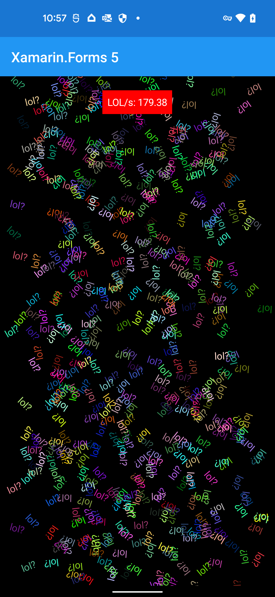
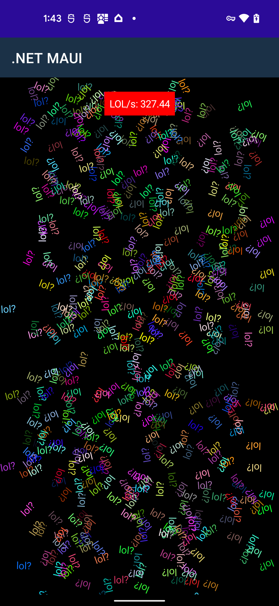
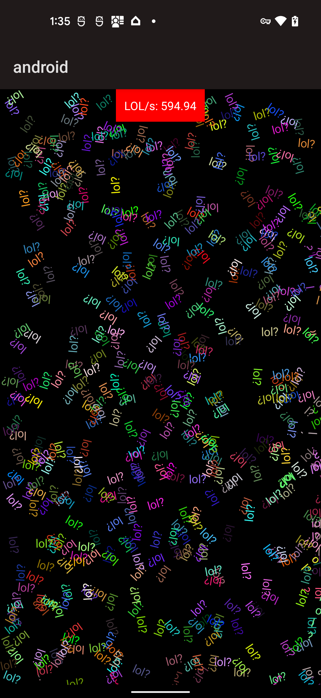
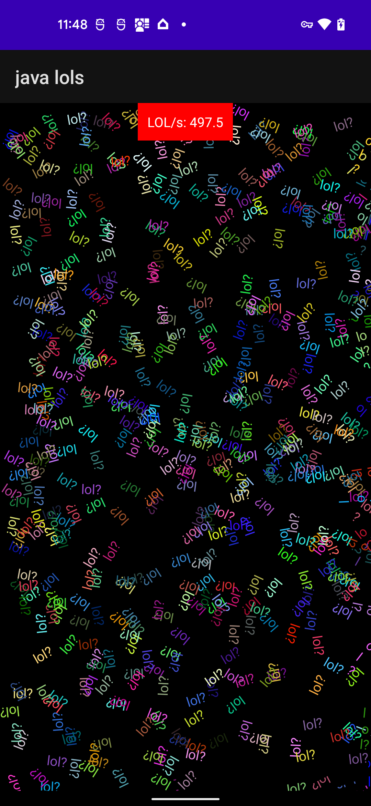

# LOLs per second

A .NET MAUI performance test similar to:

* https://github.com/maxim-saplin/dopetest_xamarin
* https://github.com/maxim-saplin/dopetest_flutter
* https://github.com/unoplatform/performance/tree/master/src/dopes/DopeTestMaui

This puts a number of labels on the screen with a random color and
random rotation -- measuring the "LOLs per second".

In many ways, this test is a bit dubious, but it is worthwhile
comparing three types of apps that use the same underlying Android
stack and `Android.Widget.TextView`:

1. Xamarin.Forms 5 app - the `Label` class is a cross-platform layer over `TextView`, using an older Mono runtime & BCL
2. .NET MAUI app - the `Label` class is a cross-platform layer over `TextView`, using the latest runtime & BCL
3. .NET 6 Android app - use `TextView` directly, but with the interop overhead of calling from C# into Java
4. Java Android app - use `TextView` directly, without any C# to Java interop

Using these three apps, I think we have a reasonable estimate of what
the overhead of using .NET (and .NET MAUI) comparing against the Java app.

Profiling the .NET MAUI app is also quite useful, I've found several
things to fix when doing this:

* https://github.com/dotnet/maui/pull/7996
* https://github.com/dotnet/maui/pull/8001
* https://github.com/dotnet/maui/pull/8033
* https://github.com/dotnet/maui/pull/8034
* https://github.com/dotnet/maui/pull/8250

## Xamarin.Forms 5 Pixel 5

~179 per second in Xamarin.Forms 5:

Thanks [@roubachof](https://github.com/roubachof) for this sample!

## .NET MAUI Android Pixel 5

~327 per second in .NET 6 MAUI:

Note that I was getting around 397 already in .NET 7 MAUI.

## .NET 6 Android Pixel 5

~594 per second in .NET 6:

## Java Android Pixel 5

~682 per second using straight Java:

## How does Flutter compare?

A reported number is 12,255 per second:

Note that the test may not be exactly the same -- or running on the
same device.

The problem with this test in Flutter, is it has a different UI
paradigm than `Android.Widget.TextView`. The main bottleneck in the
Java sample is the use of `runOnUiThread`, you can't add a `TextView`
to the screen without this call.

Basically what Flutter is doing:

1. Create a "Label" that is an object that represents text

2. A render thread (running at either 60hz or 120hz) loops over the
   labels and renders them.

If I were to reproduce this same logic in C#:

1. Create a POCO (plain old C# object) with all the values.

2. Push the objects into a `ConcurrentQueue`

3. Call `Invalidate()`

4. The UI thread overrides `OnDraw()`, loop over the `ConcurrentQueue`
   and draw them.

This results in a *completely ridiculous* ~152,661 per second:

Thus, I think measuring the LOLs per second with this UI paradigm
isn't actually useful or measuring anything. Measuring how many times
per second I can create a POCO and place it in a queue? This is
effectively what Flutter is doing, and we can also achieve it in C#.
Both are basically 60/120 per second depending on how fast the UI
thread is refreshing the screen.

However! It is worth considering if *something* in .NET could be
implemented the same way as Flutter. Perhaps measuring battery or CPU
usage with 60/120 per second would be a more useful test.

You can find the code for this on the [canvas branch](https://github.com/jonathanpeppers/lols/blob/canvas/src/android/LolsView.cs).
